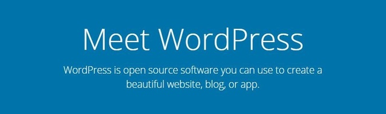
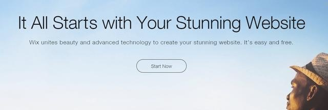
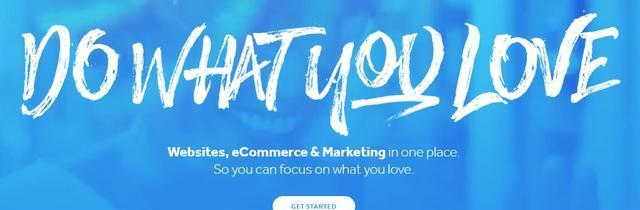
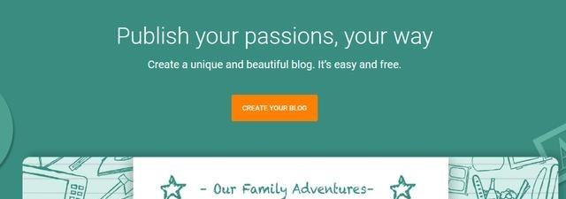
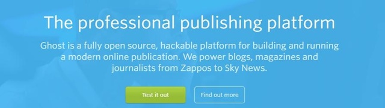

# 9 款最好的免费博客网站对比

[原文](https://baijiahao.baidu.com/s?id=1575508788815900&wfr=spider&for=pc)

弄一个博客听起来好简单 – 你只要捡一个主题然后写就行了。不过，比起这种简单的想法，实际要麻烦得多。比如，你也需要选择合适的平台来托管这个博客，而做这个决定并不简单哦。

博客网站平台选择对了，可以帮助你让博客真正落地，让你在这个新项目中应付自如。在本文中，我们将对网络上九个顶级的免费博客网站做一下横向比较，希望能在选择合适的站点这个问题上帮助到你。那就让我们开始吧！

**9 款最好的免费博客网站对比**

在这个列表中会涵盖范围广泛的免费博客网站，其中就包括一些自托管的选择。 这里的选择对所有人都挺合适，所以无论你的经验水平如何，值得花点时间在这里面找到一个合适的（可能的话，你可以自己上手试试）。

## WordPress

1. WordPress：https://wordpress.org/

如果是 WordPress，那么你有两种选择 - 自主版本和WordPress.com。我们是前者的大粉丝，但有些人可能更喜欢使用后者。

如果您只是想快速地开始写博客，而且不想去自己找一台Web主机托管博客，那么WordPress.com也许就是一个不错的选择。 不过要记得，WordPress.com所提供的托管只拥有一点点的定制能力。你无法接触到所有的WordPress的插件或主题，不过如果你改变了 WordPress.com的这个主意，可以随时对内容进行迁移。

此外，自托管的WordPress可以提供高度灵活和可定制的平台来供你创建网站。 由于它是一个开源平台，所以你可以进行随意的自定义，使其能适合托管内容日益丰富的博客。

并且，自定义路由使你能加上更加强大的主题，比如Divi。该主题包括各种各样的模块，它们可以帮助你对博客进行自定义，而且还提供预先构建好的布局，以帮助你快速入门——这样就很容易掌握了。

**主要特征：**

能够构建任何类型的网站，包括博客。

如果使用自托管的WordPress，则可以接触到数以千计插件和主题资源。

使你可以几乎完全控制自己博客的方方面面，涵盖了风格和功能。

**价格**：自己搭建的WordPress是免费的 | 更多信息：https://wordpress.org/

## Drupal

2. Drupal：https://www.drupal.org/

Drupal 是另外一个鼎鼎大名的自托管平台。它是一个开源的解决方案，支撑了政府和高校诸多很受欢迎的站点, 对于普通的博客而言它也是一个好的选择。

除了可以免费使用之外，它还为你提供了一整套主题和模块（也就是它们的插件版本）。另外，还有几个免费的发行版可以让你下载到平台的捆绑版本，这样就可以轻松调教出特定类型的网站。

可以用来创建博客和其他类型的网站。

有活跃的社区和出色的文档可供使用。

拥有各种各样的模块和主题可供使用。

可以下载到该平台的默认版本或捆绑版本。

**价格**：免费 | 更多信息：https://www.drupal.org/

## Joomla

3. Joomla!：https://www.joomla.org/

Joomla! 因其灵活性和易用性成为我们最喜欢的内容管理系统（CMS）之一。 如果你向我们求助，那么当问题涉及到功能时，它就是最接近自托管WordPress的选择之一，如果你不想要特定功能的平台，那就这就是一个很好的选择。

在这种情况下，我们所说的也是一个自托管的平台，所以要不要花钱取决于你选择了什么样的网络托管服务商。但是，Joomla！ 是一个非常轻量级的平台，它内置了缓存功能，可以快速地加载网站。

可通过扩展功能来增强网站的功能。

内置缓存和搜索引擎优化（SEO功能）。

可以直观的仪表板快速地编辑博客内容。

**价格**：免费 | 更多信息：https://www.joomla.org/

## Wix

4. Wix：https://www.wix.com/

Wix是最受欢迎的网站托管平台之一，由于其拥有拖放功能，所以非常易于使用。 你还可以访问到诸多模板库，以便更快地创建出页面。

如果选择了它，那主要的问题就是Wix本身不是一个免费的平台 —— 它只提供一定程度的免费。你会得到一个勉强够用的500MB的空间来托管自己的网站。 不过，你无法将域名指向自己的网站，而且还得处理广告。这对于个人博客而言可能没啥，但可能没法成为一个专业网站的好方案了。

提供了拖拽工具来创建风格时尚的站点

提供了诸多预先将模板构建好了的扩展库

可自动创建出网站的响应式版本。

可通过Wix的专用库安装任意数量的应用程序。

**价格**：包括免费和溢价计划 | 更多信息：https://www.wix.com/

## Weebly

5. Weebly：http://www.weebly.com/

Weebly 在许多方面都非常类似于我们之前的那一个选择。一个站点它只为你提供最多500MB的空间，免费试用，如果选择了这个方案，那就还必须使用子域。

该平台还强调其顶级的拖放式构建器是主要卖点，而且提供了数十种现代风格的模板。 而有点东西其实是可以分开使用的，例如，你可以使用移动应用程序来管理自己的网站，再然后可以引入一套还不错的SEO功能。

Weebly最大的缺点与Wix类似，就是免费方案中包含广告。如果你不在乎这个，那么这个托管博客的方案就可能是一个很好的选择。

**主要特点：**

提供了一个模板库来创建时髦的博客。

包含一个可拖拽的构建器来定制自己的网站.

允许你访问大量的应用程序集来扩展你的站点的功能。

可以让你使用内置的功能来优化你的站点的SEO

让你可以使用专用的移动应用来管理你的站点。

**价格**：免费和可用的最佳服务计划 | 更多信息：http://www.weebly.com/

## Blogger

6. Blogger：https://www.blogger.com/

Blogger 是最老的免费博客站点之一。于 2003 年被 Google 购买后就平步青云。迄今为止，该托管平台没有提供给你我们所涵盖的其他更多的功能，但这在意料之中。毕竟，虽然它确实提供了大量的功能来与观众分享你的想法，但Blogger仍是一个纯粹的博客服务。

就价格而言，Blogger是完全免费的，它能让你把你的博客连接到你自己的域名中。如果你正在找一个简洁并快速的博客，这是一个很好的选项。

能让你在几分钟内搭建一个简单的博客.

让你能够吧 blog 连接到Google账户.

给你提供的不错的现代博客的主题集

**价格：** 免费 | 更多信息：https://www.blogger.com/

## Ghost

7. Ghost：https://ghost.org/

当Ghost加入博客平台时，它还是街上的新面孔。自托管服务于2013推出，自那时起，由于以下原因，它成为我们最喜欢的选择之一：

这感觉像一个更精简的WordPress版本。 Ghost是为博客而存在的，它的每一个功能都是为了让您的过程变得更加轻松，更直观。 例如，您可以使用markdown撰写您的帖子并立即预览。 您还可以与其他作家合作，安排帖子，内容搜索引擎优化等等。

总而言之，如果您是使用尖端平台的DIY类型的博客，Ghost是一个很好的解决方案。 不过，它缺乏一个多平台支持。

使您能够同时编辑和预览您的帖子。

提供排版您的内容的方法。

让您与其他出版商合作。

提供内置的SEO功能。

为您提供创建加速移动页面（AMP）的方法。

支持RSS订阅源，电子邮件订阅和Slack集成。

**价格：**免费| 更多信息：https://ghost.org/

## Tumblr

8. Tumblr：http://tumblr.com/

Tumblr在博客方面没有声誉不是最好的。 有些人认为它不是一个严肃的平台，但如果你想要设立一个个人博客，它可能是一个不错的选择。 它很容易上手，用起来感觉比较专业，它还有一些固定的读者。

如果您想要设立个人博客，但不知道如何获得第一批读者的话，最后一点可能会很有用。 有了Tumblr，人们会迟早会发现你的博客，他们可以使用平台的内置功能来让你更多的曝光。

提供社交媒体平台和博客的结合。

为短格式内容提供优化。

快速学习曲线，让您立即开始博客。

**价格：**免费 | 更多信息：http://tumblr.com/

## Medium

9. Medium：https://medium.com/

Medium是一个现代化的免费博客网站，旨在为人们提供一种简单的方式来分享他们的想法，并帮助他人找到有趣的文章。 与其他平台不同，您只需要打开一个免费的帐户，并使用内置的编辑器发布你的帖子即可。 Medium是为了可读性而建立的，对于长期维护的内容来说，这是一个很棒的选择。

如果您不想你自己的网站设置太麻烦，Medium 就是一个不错的选择。 此外，您的某篇帖子还有机会可以在平台上得到曝光。

让您使用简单的编辑器发布文章。

提供内容优化的可读性。

让读者喜欢，分享和加入你的内容。

**价格：**免费| 更多信息：https://medium.com/

## 总论

开始一个博客不是在公园散步，但也不必过于复杂。 有很多免费博客网站可供选择，为您选择正确的一个可以使您的工作更容易。

你可能猜到了，我们就是 WordPress 自主版本的超级粉丝。 它是一个强大的平台，具有广泛的定制和强大的主题，如Divi。 但是，有些人可能会喜欢使用易于设置的托管选项，例如Wix。 没有一个平台能适用于所有人，所以在选择一个平台之前，请先进行充分了解。

您是否使用此列表中的介绍的博客网站（WordPress除外），以及您是如何享用的？ 欢迎在评论区留言！