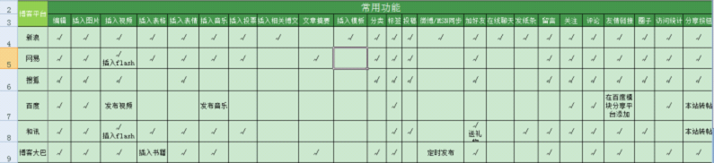
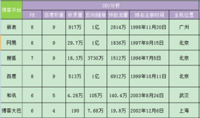
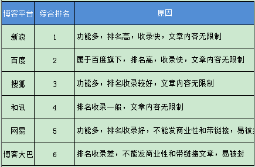

### 各大门户网站博客对比

[原文](http://www.netconcepts.cn/personal-blog/12158.html)

对于经常用博客做外链的人来说，挑选一些适合的门户博客，是提高工作效率的一个重要方法。在做外链的过程中，我对各大门户网站的博客进行了对比，算是对自己工作的总结，也希望能对外链新手有些帮助。

我选取了六大博客网站：新浪博客、网易博客、搜狐博客、百度空间、和讯博客、博客大巴。

## 一、注册难易度对比

所有的博客注册都需要邮箱验证，所以在注册之前，要申请好邮箱。

但也有一些门户网站提供较便捷的注册通道：新浪博客可以用新浪邮箱/微博/MSN账号直接开通，网易博客可以用网易邮箱/MSN账号直接开通，搜狐博客可以用搜狐邮箱、QQ、百度、淘宝、人人账号开通，百度空间可以用百度账号直接开通，和讯博客可以用新浪微博、QQ、MSN、百度账号直接开通。

## 二、功能对比

经过近些年的发展，博客的功能已经发展得很成熟。以下是一些常用功能的对比：

 

功能最多的是新浪，作为知名度最高的博客门户，新浪的功能已经设计得非常人性化。其次是搜狐和网易，功能也非常强大。百度、和讯和博客大巴稍逊一筹。

## 三、SEO分析

如果要看外链的效果，SEO分析是必须要做的功课。

 

从PR值和百度权重来说，新浪博客、网易博客、搜狐博客和百度空间都有很好的表现。在收录量方面，新浪和百度已经是遥遥领先了。在SEO分析方面，新浪博客和百度空间表现得很突出。

## 四、其它因素

**对于做博客外链的人来说，也关注以下因素：**

这六大平台的robots都是没有禁止蜘蛛访问的。对于锚文本，只有网易博客是带了nofollow的。但在回复中可以带链接的，只有和讯博客。

还有一点也是大家非常关心的，就是账号被封的几率。新浪博客、搜狐博客、百度空间、和讯博客在这一点上都是非常友好的，但是网易博客和博客大巴就非常严格了，如果刚开通了博客，就开始发一些商业广告的文章，或者文章中带锚文本，就马上会面临封号了，所以各位还是小心了。

## 总结

**以下是对这六大博客网站特点的总结：**

新浪博客功能多、博客数量大、人气旺、明星多、娱乐性强；网易博客简单易用、功能多、有深度；搜狐博客功能多、人性化；百度空间简单易用、界面简洁；和讯博客功能齐全、互动活动多、偏向财经；博客大巴是国内第一家博客托管服务商，进行商业运作、提供收费服务。

最后对这六大博客平台做一个综合排名：

 

由此得出，新浪博客和百度空间的效果是最明显的。如果你要开始做外链了，这两大平台是最佳选择。