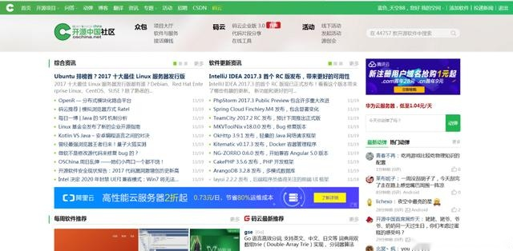
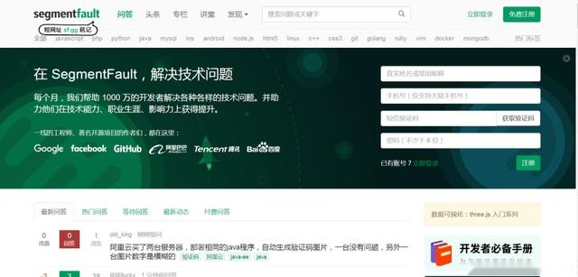
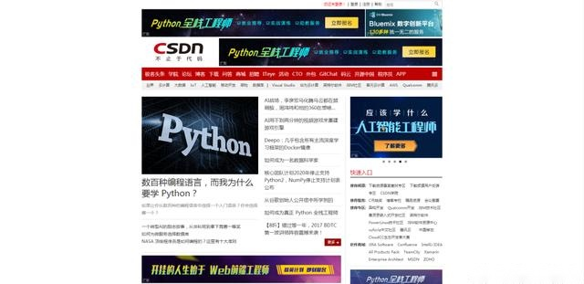
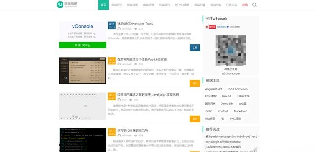
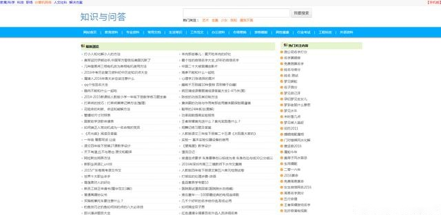

# 适合IT互联网常用的十大技术博客类网站

[原文](http://hui.sohu.com/infonews/article/6337976680702803968)

随着互联网行业的迅速发展，越来越多的人进入到这个行业来。在学习的过程中都会在学习网站或者论坛上学习，接下来让我给大家介绍几个开发者常用的技术博客类网站。

## 1. 博客园

（https://www.cnblogs.com/）

博客园是一个主要面向广大开发者的知识分享社区，方便开发者们在该社区内可以分享自己的技术成果，技术交流等等。是个纯净的技术交流社区，是个技术互相交流的平台。该社区网站唯一缺陷就是界面不是很好看，不过简洁易懂也是一大优点。

## 2. 开源中国

（https://www.oschina.net/）

开源中国是中国目前最大的一个开源技术社区，最大的优点是推广开源的项目，传播开源的理念。里面模块有很多，比如协作翻译，众包，开源软件库，代码分享，招聘，咨询等等，开IT互联网开发者有效的提供了交流，发现，使用的开源技术平台。

## 3. SegmentFault

（https://segmentfault.com/）

SegmentFault是中国领先的开发者技术社区，为热爱学习的开发者提供了一个高质量的技术交流平台，很多小白和大牛都在这发布自己遇到的技术问题，然后有很多同行都乐于帮忙解答，甚至一个问题有几个解决方案，这是一个值得推荐的技术社区平台。

## 4. CSDN

（https://www.csdn.net/）

CSDN是众多技术博客论坛的集合，有web前端博客，移动开发博客，编程语言博客，深度IT技术博客，数据库博客，云计算博客等等。唯一缺点就是最近几年商业化比较重，像百度的技术一样。

## 5. 掘金

（https://juejin.im/）

掘金，看首页就知道，是一个帮助开发者成长的社区，里面有很多技术大牛编写的技术文章含金量还是比较高的。发光点就是给开发者用的Hacker News，给设计师用的Designer News，给产品经理用的Medium。唯一缺陷就是很多人不知道它，因为网站推广不怎么重视，导致搜索引擎做得有点差劲，不过这个技术社区还是挺好的。

## 6. github

（https://github.com/）

github是一个面向开源及私有软件项目的托管平台，支持git作为唯一的版本库格式进行托管。gibhub在2008年4月10日上线，提供了讨论组，文本渲染，订阅，在线编辑文件等功能。在里面可以拥有属于自己的代码托管平台，可以上传一些属于自己的项目成果，还可以获得别人给的star！

## 7. 脚本之家

（http://www.jb51.net/）

脚本之家，也是一个很好的学习以及技术交流的网站，里面有不少的基础技术教程，还有很多问题以及问题的解决方案。还添加了电子书籍，CMS这样的分享模块。

## 8. 红黑联盟

（https://www.2cto.com/）

红黑联盟是众多大牛聚集的社区，有栏目，热点，学院，有各种各样的技术类文章，聚集了IT互联网各个行业的精华，这是讨论技术不错的社区。

## 9. 前端笔记

（http://www.w3cmark.com/）

前端笔记，一看就知道是适合前端开发者学习的社区论坛。里面有前端的最新资讯，前端的资源下载，前端周刊以及前端招聘等模块。

## 10.知识与问答

（http://www.fuzonghyn.com/）

知识与问答，这个社区不单单只是IT互联网的社区了，是全行业的社区，可以问答各种各样的问题，从生活到工作，从饮食到健康，从互联网到物联网等等。

